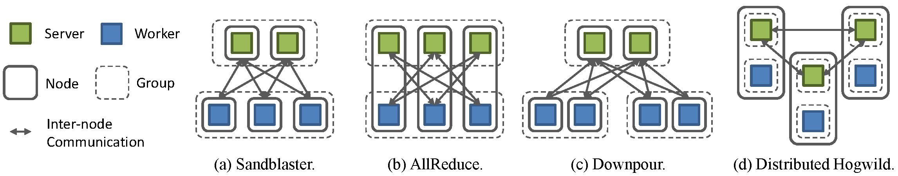

# Distributed Training Framework

---

## Cluster Topology Configuration

Here we describe how to configure SINGA's cluster topology to support
different distributed training frameworks.
The cluster topology is configured in the `cluster` field in `JobProto`.
The `cluster` is of type `ClusterProto`:

    message ClusterProto {
      optional int32 nworker_groups = 1;
      optional int32 nserver_groups = 2;
      optional int32 nworkers_per_group = 3 [default = 1];
      optional int32 nservers_per_group = 4 [default = 1];
      optional int32 nworkers_per_procs = 5 [default = 1];
      optional int32 nservers_per_procs = 6 [default = 1];

      // servers and workers in different processes?
      optional bool server_worker_separate = 20 [default = false];

      ......
    }

The mostly used fields are as follows:

  * `nworkers_per_group` and `nworkers_per_procs`:
  decide the partitioning of worker side ParamShard.
  * `nservers_per_group` and `nservers_per_procs`:
  decide the partitioning of server side ParamShard.
  * `server_worker_separate`:
  separate servers and workers in different processes.

## Different Training Frameworks

In SINGA, worker groups run asynchronously and
workers within one group run synchronously.
Users can leverage this general design to run
both **synchronous** and **asynchronous** training frameworks.
Here we illustrate how to configure
popular distributed training frameworks in SINGA.

<strong> Fig.1 - Training frameworks in SINGA</strong>

###Sandblaster

This is a **synchronous** framework used by Google Brain.
Fig.2(a) shows the Sandblaster framework implemented in SINGA.
Its configuration is as follows:

    cluster {
        nworker_groups: 1
        nserver_groups: 1
        nworkers_per_group: 3
        nservers_per_group: 2
        server_worker_separate: true
    }

A single server group is launched to handle all requests from workers.
A worker computes on its partition of the model,
and only communicates with servers handling related parameters.

###AllReduce

This is a **synchronous** framework used by Baidu's DeepImage.
Fig.2(b) shows the AllReduce framework implemented in SINGA.
Its configuration is as follows:

    cluster {
        nworker_groups: 1
        nserver_groups: 1
        nworkers_per_group: 3
        nservers_per_group: 3
        server_worker_separate: false
    }

We bind each worker with a server on the same node, so that each
node is responsible for maintaining a partition of parameters and
collecting updates from all other nodes.

###Downpour

This is a **asynchronous** framework used by Google Brain.
Fig.2(c) shows the Downpour framework implemented in SINGA.
Its configuration is as follows:

    cluster {
        nworker_groups: 2
        nserver_groups: 1
        nworkers_per_group: 2
        nservers_per_group: 2
        server_worker_separate: true
    }

Similar to the synchronous Sandblaster, all workers send
requests to a global server group. We divide workers into several
worker groups, each running independently and working on parameters
from the last *update* response.

###Distributed Hogwild

This is a **asynchronous** framework used by Caffe.
Fig.2(d) shows the Distributed Hogwild framework implemented in SINGA.
Its configuration is as follows:

    cluster {
        nworker_groups: 3
        nserver_groups: 3
        nworkers_per_group: 1
        nservers_per_group: 1
        server_worker_separate: false
    }

Each node contains a complete server group and a complete worker group.
Parameter updates are done locally, so that communication cost
during each training step is minimized.
However, the server group must periodically synchronize with
neighboring groups to improve the training convergence.
