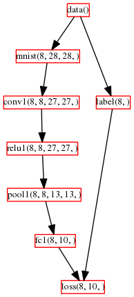
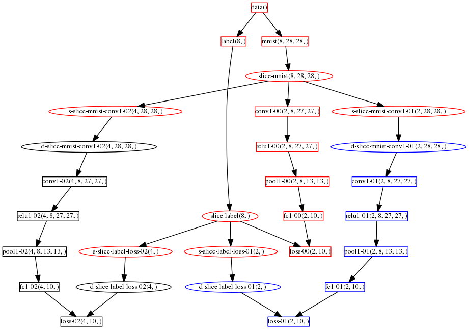
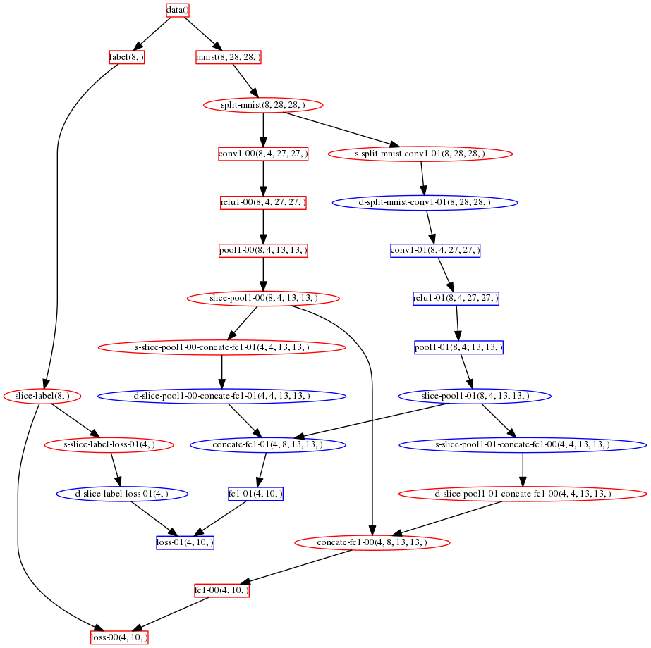

# Neural Net Partition

---

The purposes of partitioning neural network is to distribute the partitions onto
different working units (e.g., threads or nodes, called workers in this article)
and parallelize the processing.
Another reason for partition is to handle large neural network which cannot be
hold in a single node. For instance, to train models against images with high
resolution we need large neural networks (in terms of training parameters).

Since *Layer* is the first class citizen in SIGNA, we do the partition against
layers. Specifically, we support partitions at two levels. First, users can configure
the location (i.e., worker ID) of each layer. In this way, users assign one worker
for each layer. Secondly, for one layer, we can partition its neurons or partition
the instances (e.g, images). They are called layer partition and data partition
respectively. We illustrate the two types of partitions using an simple convolutional neural network.

The above figure shows a convolutional neural network without any partition. It
has 8 layers in total (one rectangular represents one layer). The first layer is
DataLayer (data) which reads data from local disk files/databases (or HDFS). The second layer
is a MnistLayer which parses the records from MNIST data to get the pixels of a batch
of 8 images (each image is of size 28x28). The LabelLayer (label) parses the records to get the label
of each image in the batch. The ConvolutionalLayer (conv1) transforms the input image to the
shape of 8x27x27. The ReLULayer (relu1) conducts elementwise transformations. The PoolingLayer (pool1)
sub-samples the images. The fc1 layer is fully connected with pool1 layer. It
mulitplies each image with a weight matrix to generate a 10 dimension hidden feature which
is then normalized by a SoftmaxLossLayer to get the prediction.

The above figure shows the convolutional neural network after partitioning all layers
except the DataLayer and ParserLayers, into 3 partitions using data partition.
The read layers process 4 images of the batch, the black and blue layers process 2 images
respectively. Some helper layers, i.e., SliceLayer, ConcateLayer, BridgeSrcLayer,
BridgeDstLayer and SplitLayer, are added automatically by our partition algorithm.
Layers of the same color resident in the same worker. There would be data transferring
across different workers at the boundary layers (i.e., BridgeSrcLayer and BridgeDstLayer),
e.g., between s-slice-mnist-conv1 and d-slice-mnist-conv1.

The above figure shows the convolutional neural network after partitioning all layers
except the DataLayer and ParserLayers, into 2 partitions using layer partition. We can
see that each layer processes all 8 images from the batch. But different partitions process
different part of one image. For instance, the layer conv1-00 process only 4 channels. The other
4 channels are processed by conv1-01 which residents in another worker.

Since the partition is done at the layer level, we can apply different partitions for
different layers to get a hybrid partition for the whole neural network. Moreover,
we can also specify the layer locations to locate different layers to different workers.
