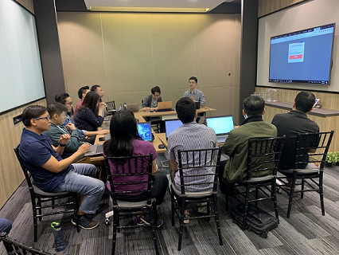
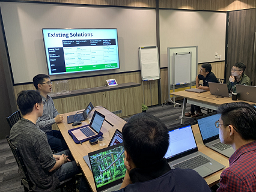

.. Licensed to the Apache Software Foundation (ASF) under one
   or more contributor license agreements.  See the NOTICE file
   distributed with this work for additional information
   regarding copyright ownership.  The ASF licenses this file
   to you under the Apache License, Version 2.0 (the
   "License"); you may not use this file except in compliance
   with the License.  You may obtain a copy of the License at

   http://www.apache.org/licenses/LICENSE-2.0

   Unless required by applicable law or agreed to in writing,
   software distributed under the License is distributed on an
   "AS IS" BASIS, WITHOUT WARRANTIES OR CONDITIONS OF ANY
   KIND, either express or implied.  See the License for the
   specific language governing permissions and limitations
   under the License.

Welcome to Apache SINGA
=======================

Recent News
-----------

* SINGA graduated as a Top-Level Project (TLP) of the Apache Software Foundation on 16 Oct 2019.

* Food(lg), the mobile app to `help patients with prediabetes <https://ssi.nus.edu.sg/ntfgh/>`_, is powered by SINGA and this app can now be downloaded on the `APP Store <https://apps.apple.com/us/app/food-lg/id1213299378>`_ or `Google Play <https://play.google.com/store/apps/details?id=com.nusidmi.foodlg&hl=en_SG>`_. Watch this `video <https://www.youtube.com/watch?v=MHp-saJiP-0>`_ of Food(lg) for more details.

* A tutorial on SINGA was given at Singapore Infocomm Media Development Authority (IMDA), 16 August, 2019. Snapshots of the tutorial:

* SINGA participated in mentoring the Google Summer of Code 2019 project `SpamAssassin : Statistical Classifier Plugin <https://summerofcode.withgoogle.com/projects/#5612088771215360>`_ .

* SINGA participated at `EU FOSSA Apache Hackathon <https://eufossa.github.io/apache-hackathon-2019/>`_ in Brussels on 4 and 5 May 2019.

* **Version 2.0.0** is now available, 20 April, 2019. `Download SINGA v2.0.0 <downloads.html>`_

* SINGA was presented at `DISI, University of Trento, Italy <https://www.disi.unitn.it/>`_ on 14 December 2018.

* SINGA was presented at `DIBRIS, University of Genoa, Italy <https://www.dibris.unige.it/>`_ on 16 July 2018.

* **Version 1.2.0** is now available, 6 June, 2018. `Download SINGA v1.2.0 <downloads.html>`_

* **Version 1.1.0** is now available, 12 Feb, 2017. `Download SINGA v1.1.0 <downloads.html>`_

* A tutorial on SINGA V1 will be given at `SGInnovate <https://www.eventbrite.sg/e/ai-eveningssginnovate-apache-singa-tickets-31505061487>`_, on 23 March, 2017

* **Version 1.0.0** is now available, 9 Sep, 2016. `Download SINGA v1.0.0 <downloads.html>`_

* SINGA will be presented at `REWORK <https://www.re-work.co/events/deep-learning-singapore/schedule>`_, 21 Oct, 2016.

* SINGA was presented at `PyDataSG <http://www.meetup.com/PyData-SG/events/229691286/>`_, 16 Aug, 2016.

* **Version 0.3.0** is now available, 20 April, 2016. `Download SINGA v0.3.0 <downloads.html>`_

* **Version 0.2.0** is now available, 14 Jan, 2016. `Download SINGA v0.2.0 <downloads.html>`_.

* SINGA was presented at `Strata+Hadoop <http://strataconf.com/big-data-conference-sg-2015/public/schedule/detail/45123>`_ on 2 Dec, 2015

* SINGA was presented at `ACM Multimedia <http://www.acmmm.org/2015/at-a-glance/>`_ Best Paper session and Open Source Software Competition session, 26-30 Oct, 2015 (`Slides <http://www.comp.nus.edu.sg/~dbsystem/singa//assets/file/mm2015.ppt>`_)

* **Version 0.1.0** is now available, 8 Oct, 2015. `Download SINGA v0.1.0 <downloads.html>`_.

* SINGA was presented at `workshop on deep learning <http://www.comp.nus.edu.sg/~dbsystem/singa/workshop>`_  held on 16 Sep, 2015

* SINGA was presented at `BOSS <http://boss.dima.tu-berlin.de/>`_ of `VLDB 2015 <http://www.vldb.org/2015/>`_ at Hawaii, 4 Sep, 2015. (slides: `overview <http://www.comp.nus.edu.sg/~dbsystem/singa/assets/file/singa-vldb-boss.pptx>`_, `basic <http://www.comp.nus.edu.sg/~dbsystem/singa/assets/file/basic-user-guide.pptx>`_, `advanced <http://www.comp.nus.edu.sg/~dbsystem/singa/assets/file/advanced-user-guide.pptx>`_)

* SINGA was presented at `ADSC/I2R Deep Learning Workshop <http://adsc.illinois.edu/contact-us>`_, 25 Aug, 2015.

* A tutorial on SINGA was given at VLDB summer school at Tsinghua University,  25-31 July, 2015.

* A half day tutorial on SINGA was given at I2R, 29 June, 2015.

* SINGA was presented at `DanaC <http://danac.org/>`_ of `SIGMOD 2015 <http://www.sigmod2015.org/index.shtml>`_ at Melbourne, 31 May - 4 June, 2015.

* SINGA has been accepted by `Apache Incubator <http://incubator.apache.org/>`_, 17 March, 2015.

Getting Started
---------------
* `Install SINGA <docs/installation.html>`_ via conda, apt-get, or from source.

* Try SINGA on `AWS <https://aws.amazon.com/marketplace/pp/B01NAUAWZW>`_ or via `Docker <https://hub.docker.com/r/apache/singa/>`_.

* Refer to the `Jupyter notebooks <http://nbviewer.jupyter.org/github/apache/singa/blob/master/doc/en/docs/notebook/index.ipynb>`_ for some basic examples and the `model zoo page <./docs/model_zoo/index.html>`_ for more examples.

+---------+
| |logo|  |
+---------+

Documentation
-------------

* Documentation and Python APIs are listed `here <docs.html>`_.
* `C++ APIs <doxygen/html/index.html>`_ are generated by Doxygen.
* Research publication list is available `here <http://www.comp.nus.edu.sg/~dbsystem/singa/research/publication/>`_.

How to contribute
----------------------

As with any open source project, there are several ways you can help:

* Join the [mailing list](http://singa.apache.org/en/community/mail-lists.html) and answer other user's questions.
* [Help with the documentation](http://singa.apache.org/en/develop/contribute-docs.html) by updating webpages that are lacking or unclear.
* [Contribute code to SINGA](http://singa.apache.org/en/develop/contribute-code.html) by fixing errors or adding new features. [All issues are tracked](http://singa.apache.org/en/community/issue-tracking.html) on the JIRA system.

History
------------

SINGA was initiated by the DB System Group at National University of Singapore in 2014, in collaboration with the database group of Zhejiang University.
Please cite the following two papers if you use SINGA in your research:

* B\. C\. Ooi, K.-L. Tan, S. Wang, W. Wang, Q. Cai, G. Chen, J. Gao, Z. Luo, A. K. H. Tung, Y. Wang, Z. Xie, M. Zhang, and K. Zheng. `SINGA: A distributed deep learning platform <http://www.comp.nus.edu.sg/~ooibc/singaopen-mm15.pdf>`_. ACM Multimedia (Open Source Software Competition) 2015 (`BibTex <http://www.comp.nus.edu.sg/~dbsystem/singa//assets/file/bib-oss.txt>`_).

* W\. Wang, G. Chen, T. T. A. Dinh, B. C. Ooi, K.-L.Tan, J. Gao, and S. Wang. `SINGA: putting deep learning in the hands of multimedia users <http://www.comp.nus.edu.sg/~ooibc/singa-mm15.pdf>`_. ACM Multimedia 2015 (`BibTex <http://www.comp.nus.edu.sg/~dbsystem/singa//assets/file/bib-singa.txt>`_, `Slides <http://www.comp.nus.edu.sg/~dbsystem/singa/assets/file/mm2015.ppt>`_).

Rafiki is a sub module of SINGA. Please cite the following paper if you use Rafiki in your research:

* Wei Wang, Jinyang Gao, Meihui Zhang, Sheng Wang, Gang Chen, Teck Khim Ng, Beng Chin Ooi, Jie Shao, Moaz Reyad. `Rafiki: Machine Learning as an Analytics Service System <http://www.vldb.org/pvldb/vol12/p128-wang.pdf>`_. `VLDB 2019 <http://vldb.org/2019/>`_ (`BibTex <https://dblp.org/rec/bib2/journals/pvldb/WangWGZCNOS18.bib>`_).

Companies like `NetEase <http://tech.163.com/17/0602/17/CLUL016I00098GJ5.html>`_, `yzBigData <http://www.yzbigdata.com/en/index.html>`_, `Shentilium <https://shentilium.com/>`_, `Foodlg <http://www.foodlg.com/>`_ and `Medilot <https://medilot.com/technologies>`_ are using SINGA for their applications.

.. toctree::
   :hidden:

   docs/index

License
----------
SINGA is released under `Apache License Version 2.0 <http://www.apache.org/licenses/LICENSE-2.0>`_.
