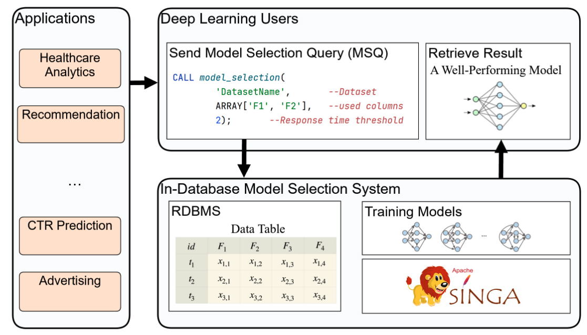
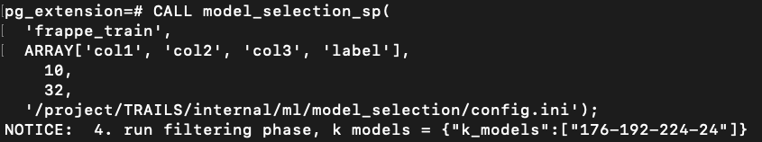

<!--
    Licensed to the Apache Software Foundation (ASF) under one
    or more contributor license agreements.  See the NOTICE file
    distributed with < this work for additional information
    regarding copyright ownership.  The ASF licenses this file
    to you under the Apache License, Version 2.0 (the
    "License"); you may not use this file except in compliance
    with the License.  You may obtain a copy of the License at

      http://www.apache.org/licenses/LICENSE-2.0

    Unless required by applicable law or agreed to in writing,
    software distributed under the License is distributed on an
    "AS IS" BASIS, WITHOUT WARRANTIES OR CONDITIONS OF ANY
    KIND, either express or implied.  See the License for the
    specific language governing permissions and limitations
    under the License.
-->

# Database-Native Model Selection 

​																																																		-- based on SINGA




## Build Docker Image

```bash
git clone https://github.com/apache/singa.git
cd singa/examples/model_selection/TRAILS-Database-Native-Model-Selection/
docker build -t trails-singa .
```

Inside the docker image, the PostgreSQL and its extensions are installed according to https://github.com/pgcentralfoundation/pgrx


## Run Docker Image
Download exp_data.zip from https://www.dropbox.com/scl/fi/xz4teosklwmfc5j4x2ug6/exp_data.zip?rlkey=5fk2ttib0zt49suyppcjhsrn2&dl=0
and unzip the exp_data/ folder to a specific directory (path_to_exp_data_folder)
```bash
docker run -d --name trails-singa \
  --network="host" \
  -v path_to_exp_data_folder:/project/exp_data \
  trails-singa
```

## Start PostgreSQL Instance

```bash
# 1. Run docker container
docker exec -it trails-singa bash 
# 2. Clone the code
cd ~
git clone https://github.com/apache/singa.git
cd singa/examples/model_selection/TRAILS-Database-Native-Model-Selection/
# 3. Export PYTHONPATH
export PYTHONPATH=$PYTHONPATH:./internal/ml/model_selection
# 4. Start the RDBMS and then exit
cd internal/pg_extension
cargo pgrx run
exit
cd ../..
# 5. Load data into RDBMS
bash internal/ml/model_selection/scripts/database/load_data_to_db.sh /project/exp_data/data/structure_data/frappe frappe
# 6. Run database server
cd internal/pg_extension
cargo pgrx run

```


## Register Stored Procedure

```sql
CREATE OR REPLACE
PROCEDURE model_selection_sp(
    dataset TEXT,               --dataset name
    selected_columns TEXT[],    --used columns
    N INTEGER,                  --number of models to evaluate
    batch_size INTEGER,         --batch size, for profiling, filtering
    config_file TEXT            --config file path
)
LANGUAGE plpgsql
AS $$
DECLARE
    -- global inputs/outputs
    result_status TEXT;
    column_list TEXT;
BEGIN
    -- combine the columns into a string
    column_list := array_to_string(selected_columns, ', ');

    -- 4. Run filtering phase to get top K models.
    EXECUTE format('
                WITH batch_rows AS (
                    SELECT %s
                    FROM %I
                    ORDER BY RANDOM()
                    LIMIT %s OFFSET 0
                )
                SELECT filtering_phase(
                    json_agg(row_to_json(t))::text, %s, %s, %L
                )
                FROM batch_rows AS t', column_list, dataset, batch_size, N, 1, config_file) INTO result_status;
    RAISE NOTICE '4. run filtering phase, k models = %', result_status;

END; $$;
```

# Compile the UDF

```bash
# Try compile the UDF
DROP EXTENSION IF EXISTS pg_extension;
CREATE EXTENSION pg_extension;
```

If the above fails, open another terminal and go into the docker via docker exec -it trails-singa bash
Then run the following 
```bash
rm /home/postgres/.pgrx/14.9/pgrx-install/share/extension/pg_extension--0.1.0.sql
vi /home/postgres/.pgrx/14.9/pgrx-install/share/extension/pg_extension--0.1.0.sql
# Copy the following to the /home/postgres/.pgrx/14.9/pgrx-install/share/extension/pg_extension--0.1.0.sql
-- src/lib.rs:66
-- pg_extension::filtering_phase
CREATE  FUNCTION "filtering_phase"(
    "mini_batch" TEXT, /* alloc::string::String */
    "n" INT, /* i32 */
    "k" INT, /* i32 */
    "config_file" TEXT /* alloc::string::String */
) RETURNS TEXT /* alloc::string::String */
    IMMUTABLE STRICT PARALLEL SAFE
LANGUAGE c /* Rust */
AS 'MODULE_PATHNAME', 'filtering_phase_wrapper';
```

Go back to the first terminal and run the following in the database server again  
```bash
# Try compile the UDF
DROP EXTENSION IF EXISTS pg_extension;
CREATE EXTENSION pg_extension;
```

## Run Model Selection 

```sql
-- Template for calling 'model_selection_sp' stored procedure
CALL model_selection_sp(
    <TABLE_NAME>,             -- The name of the table or dataset from which data should be retrieved.
    <COLUMN_NAMES_ARRAY>,     -- An array of column names to be considered in the model selection process.
    <PARAMETER_1>,            -- Number of models to explore
    <PARAMETER_2>,            -- Batch size
    <CONFIG_FILE_PATH>        -- The file path to a configuration file needed for the process.
);


# For example
CALL model_selection_sp(
       'frappe_train',
       ARRAY['col1', 'col2', 'col3', 'label'], 
    10, 
    32, 
  '/home/postgres/singa/examples/model_selection/TRAILS-Database-Native-Model-Selection/internal/ml/model_selection/config.ini');
```

# Example Result


