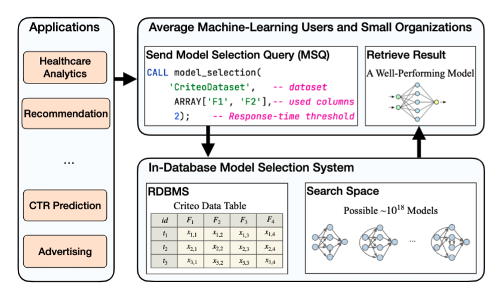
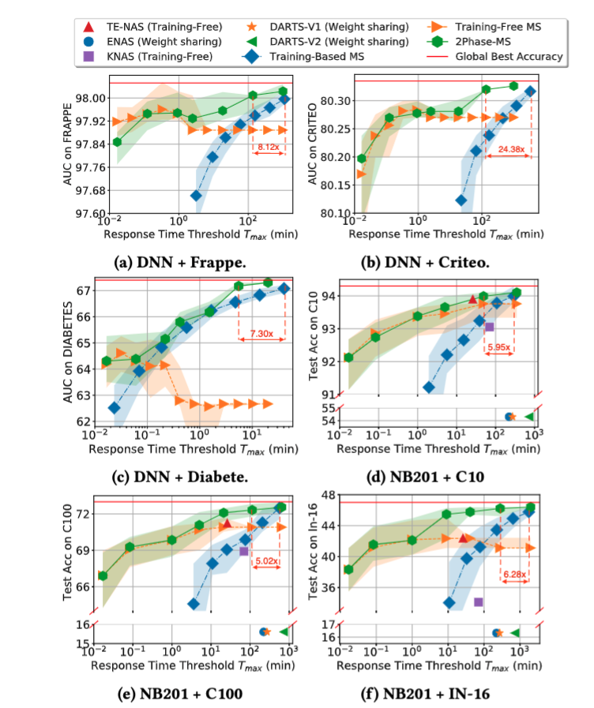
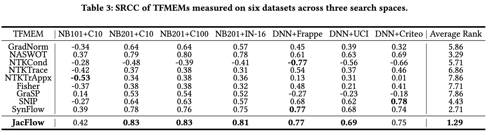
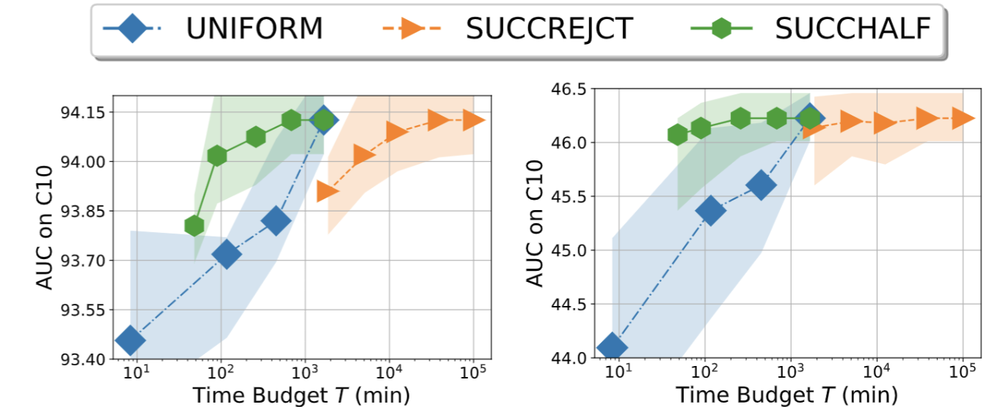
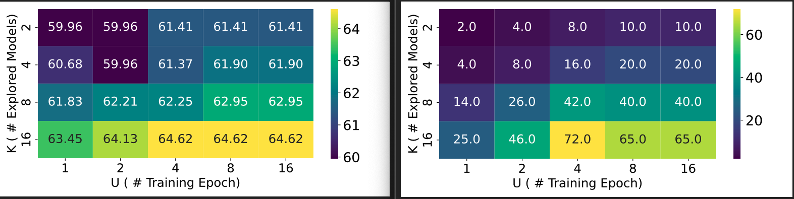
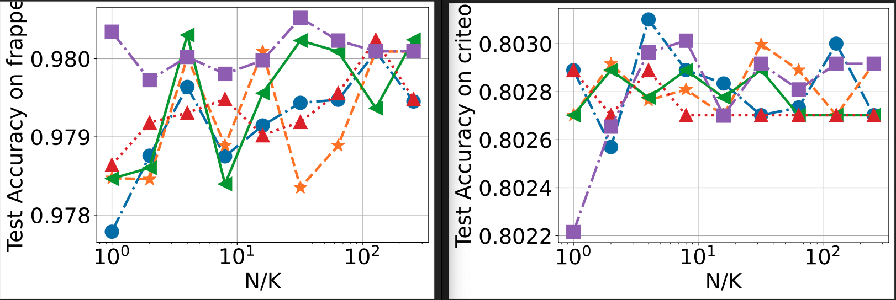
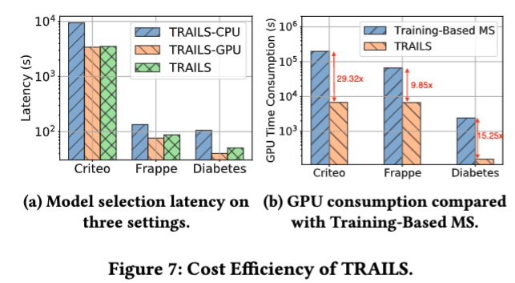
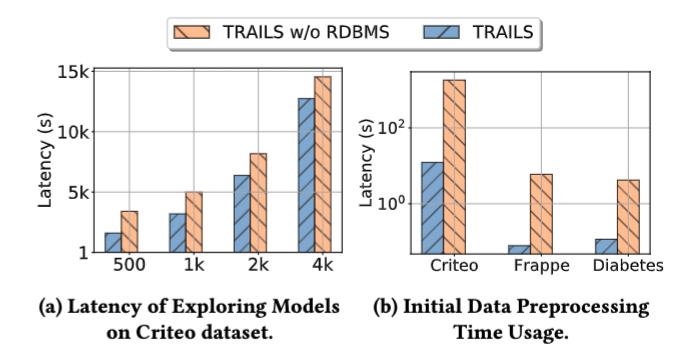
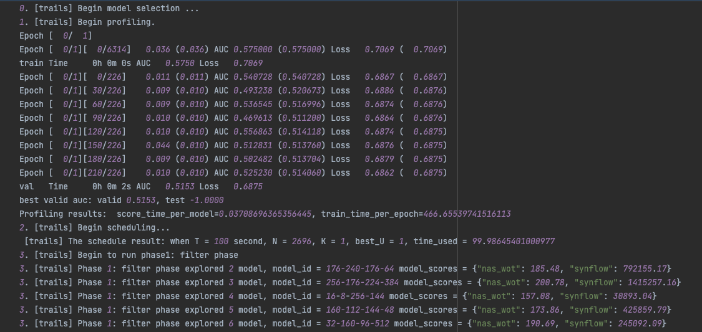
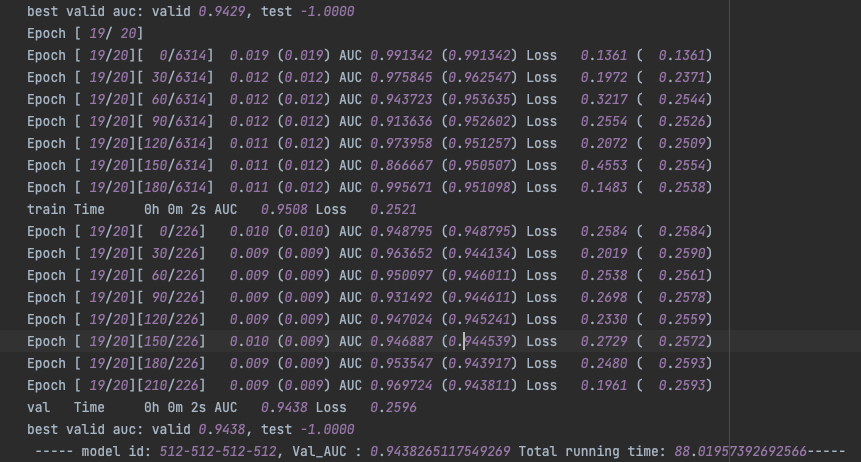

# TRAILS: A Database Native Model Selection System



[TOC]

# Config Environments

```bash
# Create virtual env
conda config --set ssl_verify false
conda create -n "trails" python=3.8.10
conda activate trails
pip install -r requirement.txt 

cd TRAILS

# make a dir to store all results. 
mkdir ../exp_data
```

# Reproduce the results

## NAS-Bench-Tabular

 NAS-Bench-Tabular can be either **download** or build from scratch.

### Download NAS-Bench-Tabular

1. **Download** the dataset using the following link, and extract them to `exp_data`

```bash
https://drive.google.com/file/d/1TGii9ymbmX81c9-GKWXbe_4Z64R8Btz1/view?usp=sharing
```

### Build NAS-Bench-Tabular

2. Build the **NAS-Bench-Tabular** from scratch

```python
# Construct NAS-Bench-Tabular: 
## 1. Training all models.
bash internal/ml/model_selection/scripts/nas-bench-tabular/train_all_models_frappe.sh
bash internal/ml/model_selection/scripts/nas-bench-tabular/train_all_models_diabetes.sh
bash internal/ml/model_selection/scripts/nas-bench-tabular/train_all_models_criteo.sh

## 2. Scoring all models using all TFMEMs.
bash internal/ml/model_selection/scripts/nas-bench-tabular/score_all_modesl_frappe.sh
bash internal/ml/model_selection/scripts/nas-bench-tabular/score_all_modesl_uci.sh
bash internal/ml/model_selection/scripts/nas-bench-tabular/score_all_modesl_criteo.sh
```

3. Build the **NAS-Bench-Img** from scratch

   To facilitate the experiments and query speed (NASBENCH API is slow)

   1. We retrieve all results from NASBENCH API and store them as a json file.
   2. We score all models in NB201 and 28K models in NB101.
   3. We search with  EA + Score and record the searching process in terms of
       `run_id,  current_explored_model, top_400 highest scored model, time_usage` 
        to SQLLite.

```python
# 1. Record NASBENCH API data into json file
## This requires to install nats_bench: pip install nats_bench
bash ./internal/ml/model_selection/scripts/nas-bench-img/convert_api_2_json.sh

# 2. Scoring all models using all TFMEMs.
nohup bash ./internal/ml/model_selection/scripts/nas-bench-img/score_all_models.sh &

# 3. Explore with EA ans score result and store exploring process into SQLLite
bash ./internal/ml/model_selection/scripts/nas-bench-img/explore_all_models.sh

# 4. Generate the baseline. 
bash ./internal/ml/model_selection/scripts/baseline_system_img.sh
```

The following experiment could then query filtering phase results based on `run_id`.

## SLO-Aware 2Phase-MS

With the above **NAS-Bench-Tabular**, we could run various experiments. 

```bash
# 1. Generate the results for drawing the figure
## tabular data: training-base-ms
bash internal/ml/model_selection/scripts/baseline_system_tab.sh
## tabular data: training-free-ms, 2phase-ms
nohup bash internal/ml/model_selection/scripts/anytime_tab.sh &
## image data: training-base-ms, training-free-ms, 2phase-ms
nohup bash internal/ml/model_selection/scripts/anytime_img_w_baseline.sh &

# 2. Draw figure
python internal/ml/model_selection/exps/macro/anytime_tab_draw.py
python internal/ml/model_selection/exps/macro/anytime_img_draw.py
```



## Micro: Benchmark TFMEMs

```bash
export PYTHONPATH=$PYTHONPATH:./internal/ml/model_selection
conda activate trails
python ./internal/ml/model_selection/exps/micro/benchmark_correlation.py
```



## Micro: Benchmark Budge-Aware Algorithm

```bash
bash internal/ml/model_selection/scripts/micro_budget_aware_alg.sh
```



## Micro: Benchmark N, K, U 

With ranking the models by ther TFMEM score in the filtering phase, we aim to determine

1. Further examinng more models  (**K**) with each going through less training epoch (**U**) is more easier to find good model?
   or examine less but each training more epochs?
2. How many models to explore (**N**) and how many to keep (**K**) ?

```bash
bash internal/ml/model_selection/scripts/micro_nku_tradeoff.sh
```

This is the experimental result conducted at the UCI Diabetes datasets.
Clearly,  expore more models in refinement phase (large **K** ) is more helpful to find the a better model. 
Although increasing **U** can find a better model accurately, it runs more training epochs leading to higher training cost. 



Then we fix **U=1** for cost efficiency and determine N/K for higher searching effectiveness. 
Clearly, K/N reaches 100 yields better scheduling result in both image and tabular dataset, thus, we set **N/K=100** in coordinator. 




## Micro: Device Placement & Embedding Cache

1. To measure the time usage for filtering phase on vairous hardware, run the following

   ```bash
   # Without embedding cache at the filtering phase
   nohup bash internal/ml/model_selection/scripts/latency_phase1_cpu_gpu.sh &
   # With embedding cache at the filtering phase (faster)
   nohup bash internal/ml/model_selection/scripts/latency_embedding_cache.sh &
   # Draw graph
   python ./internal/ml/model_selection/exps/micro/draw_filtering_latency.py
   python ./internal/ml/model_selection/exps/micro/draw_filtering_memory_bar.py
   python ./internal/ml/model_selection/exps/micro/draw_filtering_memory_line.py
   python ./internal/ml/model_selection/exps/micro/draw_filtering_memory_cache_CPU.py
   ```

2. Further we measure the end-2-end latency under two CPU, GPU, and Hybrid. 

   ```bash
   nohup bash internal/ml/model_selection/scripts/latency_phase1_cpu_gpu.sh &
   ```

## Micro: In-DB vs Out-DB filtering phase

```bash
# run out-of db, read data via psycopg2
bash ./internal/ml/model_selection/scripts/latency_phase1_in_db.sh

# run in-db query, read data via SPI
select benchmark_filtering_latency_in_db(5000, 'frappe', '/project/TRAILS/internal/ml/model_selection/config.ini');

select benchmark_filtering_latency_in_db(5000, 'uci_diabetes', '/project/TRAILS/internal/ml/model_selection/config.ini');

select benchmark_filtering_latency_in_db(5000, 'criteo', '/project/TRAILS/internal/ml/model_selection/config.ini');
```

## Micro: On-the-Fly Data transmission, Refinement

```bash
# start cache service
python ./internal/cache-service/cache_service.py 
python ./internal/cache-service/trigger_cache_svc.py
# consume from the cache-svc


```

## Reproduce Figure7

```bash
python exps/main_v2/analysis/2.\ cost_draw.py
python exps/main_v2/analysis/3.\ cost_train_based.py
```



## Reproduce Figure8

```bash
# draw figure 8(a) 
python exps/main_v2/analysis/5.draw_IDMS_var_workloads.py
# draw figure 8(b)
python exps/main_v2/analysis/6.draw_IDMS_dataloading.py
```


# Baselines

We compare with Training-Based MS, TabNAS, and training-free MS etc. 

For image data, it already generated at the NAS-Bench-Img part, see above.

# Appendix

Here all experiments is on the Frappe dataset. 

1. Computational Costs

   ```bash
   bash ./internal/ml/model_selection/exps/micro/resp/benchmark_cost.sh
   ```

2. Search Cost, multiple training-free or training-based combinations (warm-up / movel proposal)

   ```bash
   # get RL, RE, RS + training-based model evaluation
   bash ./internal/ml/model_selection/scripts/micro_search_strategy.sh
   # this will read previous file, and run warm-up/move proposal, and draw all together
   bash ./internal/ml/model_selection/exps/micro/resp/benchmark_search_cost.sh
   ```

3. How des the K influence the result?

   ```bash
   python ./internal/ml/model_selection/exps/micro/resp/benchmark_k_fix_time.py
   ```

4. Nosy in selecting top K models

   ```bash
   python ./internal/ml/model_selection/exps/micro/resp/benchmark_noisy_influence.py
   ```

5. Weight-sharing result

   ```bash
   nohup bash internal/ml/model_selection/scripts/benchmark_weight_sharing.sh &
   ```

   

   


# Run end2end model selection

download the dataset and put it in the `exp_data/data/structure_data`

```
python main.py --budget=100 --dataset=frappe
```

Check the log at the `logs_default`





