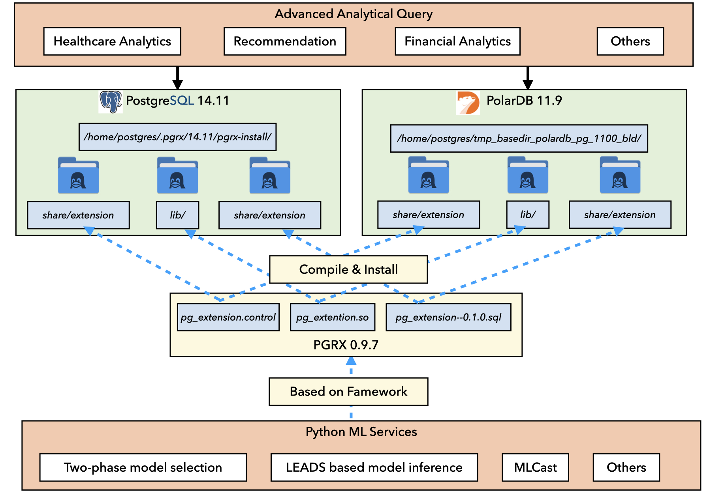

<!--
    Licensed to the Apache Software Foundation (ASF) under one
    or more contributor license agreements.  See the NOTICE file
    distributed with < this work for additional information
    regarding copyright ownership.  The ASF licenses this file
    to you under the Apache License, Version 2.0 (the
    "License"); you may not use this file except in compliance
    with the License.  You may obtain a copy of the License at

      http://www.apache.org/licenses/LICENSE-2.0
    
    Unless required by applicable law or agreed to in writing,
    software distributed under the License is distributed on an
    "AS IS" BASIS, WITHOUT WARRANTIES OR CONDITIONS OF ANY
    KIND, either express or implied.  See the License for the
    specific language governing permissions and limitations
    under the License.
-->


# TRAILS: A Database Native Model Selection System



Inside the docker image:

PostgreSQL 14.11 is installed according to https://www.postgresql.org/about/news/postgresql-14-released-2318/

PolarDB 11.9 is installed according to https://github.com/ApsaraDB/PolarDB-for-PostgreSQL

Base PolarDB Dockerfile is installed according to https://apsaradb.github.io/PolarDB-for-PostgreSQL/zh/development/customize-dev-env.html

Postgre Extension PGRX 0.9.7 is installed according to https://github.com/pgcentralfoundation/pgrx


# Build & Run examples

## Singa + PostgreSQL

```bash
# Remove existing one if there is 
docker rm -f singa_trails
# Create project folder.
mkdir project && cd project
# Download the Dockerile.
wget -O Dockerfile https://raw.githubusercontent.com/apache/singa/dev-postgresql/examples/model_selection/Trails/singa.psql.Dockerfile

# Build Dockerile and run the docker.
docker build -t singa_trails .
docker run -d --name singa_trails singa_trails
# Wait for 5 mins, monitor the logs until it shows "Done!", then exit the monitor
docker logs -f singa_trails
```
Execute model selection query
```bash
# Connect to the pg server and use pg_extension database.
docker exec -it singa_trails bash
psql -h localhost -p 28814 -U postgres
\c pg_extension

# Test coordinator
SELECT coordinator('0.08244', '168.830156', '800', false, '/project/Trails/internal/ml/model_selection/config.ini');
# Run an example, wait one min, it will run filtering + refinemnt + training the selected model.
CALL model_selection_end2end('frappe_train', ARRAY['col1', 'col2', 'col3', 'col4','col5','col6','col7','col8','col9','col10', 'label'], '10', '/project/Trails/internal/ml/model_selection/config.ini');

# In other terminal, monitor the running process
docker exec -it trails_polardb bash
tail -f /home/postgres/.pgrx/data-14/trails_log_folder/<log_file_name>
```


## Singa + PolarDB

```bash
# Remove existing one if there is 
docker rm -f trails_singa_polardb
# Create project folder.
mkdir project_polardb_singa && cd project_polardb_singa
# Download the Dockerile.
wget -O Dockerfile https://github.com/apache/singa/blob/dev-postgresql/examples/model_selection/Trails/singa.polarDB.Dockerfile

# Build Dockerile and run the docker.
docker build -t trails_singa_polardb .
docker run -d --name trails_singa_polardb trails_singa_polardb
# Monitor the logs until the setup step is done.
docker logs -f trails_singa_polardb
# Run a setup script
docker exec trails_singa_polardb /bin/bash -c "/home/postgres/Trails/init_polardb.sh"
```
Execute model selection query
```bash
# Connect to the primary pg server and use pg_extension database.
docker exec -it trails_singa_polardb bash
psql -h localhost -p 5432 -U postgres 
\c pg_extension

# Test coordinator
SELECT coordinator('0.08244', '168.830156', '800', false, '/home/postgres/Trails/internal/ml/model_selection/config.ini');
# Run an example, wait one min, it will run filtering + refinemnt + training the selected model.
CALL model_selection_end2end('frappe_train', ARRAY['col1', 'col2', 'col3', 'col4','col5','col6','col7','col8','col9','col10', 'label'], '10', '/home/postgres/Trails/internal/ml/model_selection/config.ini');

# In other terminal, monitor the running process
docker exec -it trails_singa_polardb bash
tail -f /var/polardb/primary_datadir/trails_log_folder/<log_file_name>
```
