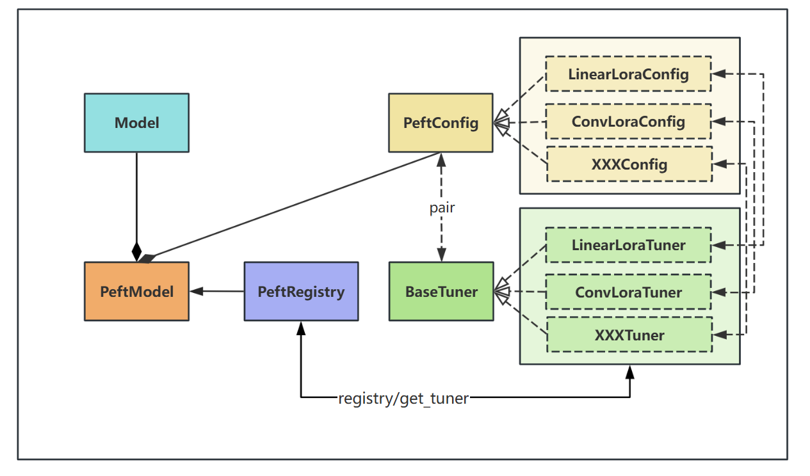

<!--
    Licensed to the Apache Software Foundation (ASF) under one
    or more contributor license agreements.  See the NOTICE file
    distributed with this work for additional information
    regarding copyright ownership.  The ASF licenses this file
    to you under the Apache License, Version 2.0 (the
    "License"); you may not use this file except in compliance
    with the License.  You may obtain a copy of the License at

      http://www.apache.org/licenses/LICENSE-2.0

    Unless required by applicable law or agreed to in writing,
    software distributed under the License is distributed on an
    "AS IS" BASIS, WITHOUT WARRANTIES OR CONDITIONS OF ANY
    KIND, either express or implied.  See the License for the
    specific language governing permissions and limitations
    under the License.
-->

# Singa PEFT

## Code structure design

The code structure design is shown in the following figure. For details, please refer to the next section, which will give a detailed explanation.




## Code structure specification

The code structure is shown in the tree structure below, which is specified as follows:

```
_singa-peft/
├── __init__.py
├── tuner/                  
│   ├── __init__.py
│   ├── base_tuner.py       
│   └── linear_lora/        
│       ├── __init__.py
│       ├── config.py       
│       ├── layer.py        
│       └── tuner.py       
├── peft_config.py         
├── peft_registry.py             
└── peft_model.py          
``` 

`peft_config.py` contains the peft configuration base class **PeftConfig**, which defines some common parameters. All other peft configuration classes must inherit from this class.


`peft_registry.py` contains the **PeftRegistry** class. You can register a new peft tuner by using the annotation `@PeftRegistry.register("xxx")`.


`base_tuner.py` contains the **BaseTuner** class, which is the base class for all tuners. All peft methods must inherit from this class and implement `inject` and `merge_weights` abstract methods.


`linear_lora/config.py` contains **LinearLoraConfig** class, and inherits from **PeftConfig** class, which includes the necessary parameters for lora method.


`linear_lora/layer.py` contains the **LinearLoRALayer** class, which is the implementation of the Lora method in a linear layer. The tuner's `inject` method replaces the linear layer in the base model with this layer.


`linear_lora/tuner.py` contains **LinearLoraTuner** class, which inherits from **BaseTuner** class. First you need to register the peft method with the annotation `@PeftRegistry.register("linear_lora")` on the class. Next, you need to implement abstract methods that inherit from **BaseTuner**, including `inject` and `merge_weights` abstraction methods. The `inject` method implementation specifies the layers to replace, for example, the normal `linear layer` instead of the `linearLora layer`. The `merge_weights` method merges the parameters of the replaced layers to speed up the inference.


Finally, if you want to extend the new peft method, you can follow the script in the `linear_lora` directory. In addition, you need to expose the corresponding classes and methods in the `__init__.py` file. Also see the scripts in the `examples` directory for how to use the library.
